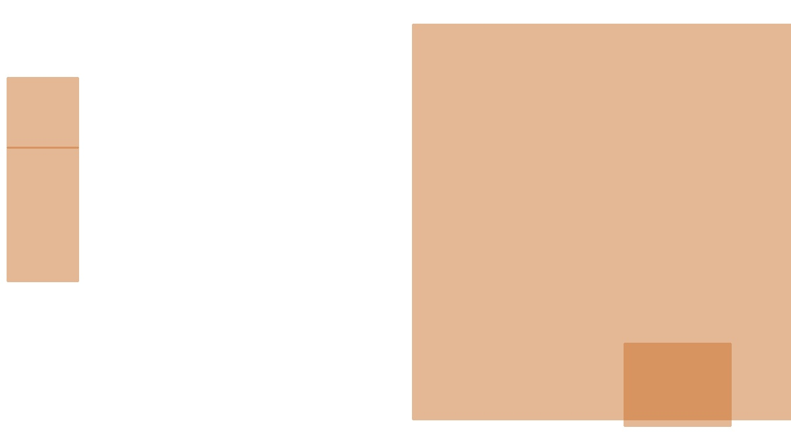
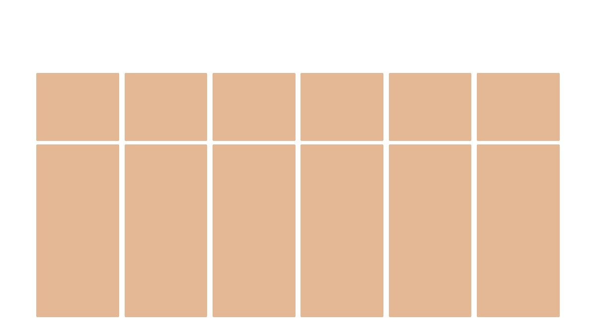

# Bbox compositions clustering
A tool for clustering bboxes compositions of different classes (by bboxes features and/or images features).  
It can be useful if you have a lot of images/other data with bboxes (for example, different fields in some files), and you need to find dependencies between them.
Kmeans, DBSCAN, OPTICS methods are supported.

## Usage
Environment: Python 3.11.5

1. Install requirements: `pip install -r requirements.txt`
2. Upload images with drawn bboxes to the dataset folder (umages must be the same size, each bbox class should be drawn in a unique color, with transparency to support the overlap)
3. Upload a dataframe with all information about the bboxes in required format (described below)
4. Specify all the required values in the `config.py`
5. Run `main.py` and follow the instructions

## Input df format

| file         | x1  | y1 | x2  | y2 |angle| depth | cls |
|--------------|-----|----|-----|----|-----|-------|-----|
| 4e060261.jpg | 889 | -72| 1321| 173| 6.25| 0     | 0   |
| cfb4c772.jpg | 880 | 473| 1125| 637| 0   | 0.6   | 0   |
| 65b269b9.jpg | 783 | 355| 1158| 566| 0   | 0.2   | 1   |
| aa04df5a.jpg | 222 | 291| 566 | 487| 0   | 0.37  | 0   |

Where columns:
* `file` - image with bboxes
* `x1, y1, x2, y2` - left/top/right/bottom bbox coordinates
* `angle` - rotation angle of bbox
* `depth` - z-order (depth) of bbox
* `cls` - bbox class

## Example images

  
  
  
  

  
  
  
  

  
  
  
  

  
  
  
  

## Useful links
* [PCA](https://365datascience.com/tutorials/python-tutorials/pca-k-means/)
* [Multidimensional Data Analysis](https://www.geeksforgeeks.org/multidimensional-data-analysis-in-python/)
* [Kmeans](https://medium.com/swlh/k-means-clustering-on-high-dimensional-data-d2151e1a4240)
* [Drawing bboxes](https://stackoverflow.com/questions/68875941/how-to-put-a-specific-coordinate-of-a-small-image-to-a-specific-coordinate-of-a)